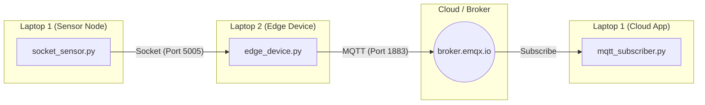

# Hybrid-IoT-Communication-Lab-Sockets-MQTT
In this lab series I built a small IoT communication pipeline using two laptops.  The system simulates:  a sensor node, an edge device, a cloud/server application. The communication technologies used are:  Socket Programming, MQTT Messaging

# IoT Communication Pipeline: Sockets to MQTT

This project demonstrates a three-tier IoT architecture simulating a sensor node, an edge device, and a cloud application.

## 🏗 System Architecture

The following diagram illustrates how data moves from the local sensor to the cloud:

Lab Configuration

Laptop 1 IP is 192.168.89.x (Client) or I used 0.0.0.0  or you can use Mobile Hotspot (Galaxy)

Laptop 2 IP (Edge) 192.168.89.175 (or 192.168.123.175) 

Socket Port 5000 

MQTT Brokerbroker.emqx.io

MQTT Topic   savonia/iot/temperature

Execution Order
Laptop 1: Run subscriber.py

Laptop 2: Run edge_device.py

Laptop 1: Run socket_sensor.py

Lab 1: Sensor to Edge (Socket Programming)
Objective: Direct communication between two devices.

Run: socket_server.py on Laptop 2, then socket_sensor.py on Laptop 1.

Lab 2: Edge to Cloud (MQTT)
Objective: Implement MQTT messaging to forward data to a global broker.

Run: subscriber.py on Laptop 1, then publisher.py on Laptop 2.

Lab 3: Full IoT Pipeline (Integration)
Objective: Combine both systems into a complete bridge.

Run: edge_device.py on Laptop 2 to catch socket data and push it to the cloud.

Before that Install the Paho MQTT library on both devices:

pip install paho-mqtt

